# iot_ws2_part2

## Overview
This IoT Chat Application facilitates real-time communication between clients through a central server, supporting both direct and broadcast messaging. Developed for the Internet of Things course, it's designed to help students understand network programming, message handling, and protocol design. This version introduces a feature for group messaging, allowing users to create groups, add members, and communicate within these groups, even if some members are not currently online.

## Getting Started

### Prerequisites
- C++17 compiler (e.g., GCC, Clang)
- Make (for building the application)
- Linux-based OS (the application has been tested on Ubuntu and Debian)
- /opt/iot UWE Library

### Installation
1. Clone the repository:

    ~~~bash
    git clone https://gitlab.uwe.ac.uk/br-gaster/iot_ws2_part2.git
    ~~~

2. Navigate to the project directory:

    ~~~bash
    cd iot_ws2_part2/Task1\ 2\ and\ 3/
    ~~~

3. Build the server and client applications:
    ~~~bash
    make all
    ~~~

4. Clearing the packets:
    ~~~bash
    /opt/iot/bin/packets_clear

    //note that the packets should be cleared before every run
    ~~~

## Task 1: Server Side

### Overview 
In this task, you'll be working on enhancing the server side of a chat application by implementing missing functionalities in chat_server.cpp. The focus is on handling specific types of messages according to a predefined chat protocol.

### Running The Server
~~~bash
./chat_server
~~~

### Task Breakdown

1. **Core Implementation:** 

    * Server Function: Dive into the void server(); function, where the server listens for and processes incoming messages.

    * Message Handling: Ensure messages received match the expected size and format, converting them into structured chat::message objects for processing.

3. **Key Functions to Implement:**

    * Join Handler (handle_join): Manage new client connections, registering them in the server's list of active users.
    * Direct Message Handler (handle_directmessage): Facilitate sending messages from one client directly to another.
    * Exit Handler (handle_exit): Process client requests to leave the chat, removing them from the server's active user list.

4. **Supporting Details:**
    * Understand the chat_message structure and chat_type enum from chat.hpp for message formatting.
    * Use the online_users map to track and manage connected clients.

### Handles Detail

1.  **Join Handler (handle_join):** 

    ~~~c++
    void handle_join(
    online_users& users, std::string username, std::string,
    struct sockaddr_in& client_address, uwe::socket& sock, bool& exit_loop) {
    
    if (users.find(username) != users.end()) {
        handle_error(ERR_USER_ALREADY_ONLINE, client_address, sock, exit_loop);
    } else {
        auto* addr = new sockaddr_in(client_address);
        users[username] = addr;
        
        auto msg = chat::jack_msg();
        sock.sendto(reinterpret_cast<const char*>(&msg), sizeof(msg), 0, (sockaddr*)&client_address, sizeof(client_address));
        
        for (const auto& user : users) {
            if (user.first != username) {
                auto broadcastMsg = chat::broadcast_msg("Server", username + " has joined the chat.");
                sock.sendto(reinterpret_cast<const char*>(&broadcastMsg), sizeof(broadcastMsg), 0, (sockaddr*)user.second, sizeof(sockaddr_in));
            }
        }

        handle_list(users, USER_ALL, "", client_address, sock, exit_loop);
    }
    }
    ~~~

     

2. **Direct Message Handler (handle_directmessage):**

    ~~~c++
    void handle_directmessage(
     online_users& users, std::string sender_username, std::string message,
    struct sockaddr_in& sender_address, uwe::socket& sock, bool& exit_loop) {
    
    auto separator_pos = message.find(':');
    if (separator_pos != std::string::npos) {
        std::string recipient_username = message.substr(0, separator_pos);
        std::string actual_message = message.substr(separator_pos + 1);

        auto it = users.find(recipient_username);
        if (it != users.end()) {
            // Construct the direct message
            auto dm_msg = chat::dm_msg(sender_username, actual_message);
            
            // Send the direct message to the intended recipient
            sock.sendto(reinterpret_cast<const char*>(&dm_msg), sizeof(dm_msg), 0,
                        (sockaddr*)it->second, sizeof(sockaddr_in));
            DEBUG("Direct message sent from %s to %s: %s\n", sender_username.c_str(), recipient_username.c_str(), actual_message.c_str());
        } else {
            // Recipient user not found, handle error
            handle_error(ERR_UNEXPECTED_MSG, sender_address, sock, exit_loop);
        }
    } else {
        // Malformed direct message, handle error
        handle_error(ERR_UNEXPECTED_MSG, sender_address, sock, exit_loop);
    }
    }
    ~~~

 

3. **Exit Handler (handle_exit):**
    ~~~c++
    void handle_exit(
    online_users& users, std::string, std::string, 
    struct sockaddr_in& client_address, uwe::socket& sock, bool& exit_loop) {
    
    for (const auto& user : users) {
        auto msg = chat::exit_msg();
        sock.sendto(reinterpret_cast<const char*>(&msg), sizeof(msg), 0, (sockaddr*)user.second, sizeof(sockaddr_in));
    }
    users.clear();
    exit_loop = true;
    }
    ~~~

 

## Task 2: Client Side

### Overview

In this task, you're focusing on building and enhancing the client side of a chat application. This involves understanding and completing the **"chat_client.cpp"** code, which is designed to handle asynchronous communication between the client's user interface (UI) and the chat server. The goal is to ensure smooth and non-blocking communication within the chat application.

### Running The Client
~~~bash
./chat_client <ipaddress> <port> <username>
~~~

note: the IPs and Ports can be found in the packets file
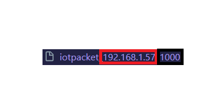

**Red: IP**

**Black: Port**

 

### Task Breakdown

1. **Understanding the Client Architecture:**

    * The client utilizes two threads: one for handling UI messages and another for handling server messages. This dual-thread setup prevents one source of messages from blocking the other.
    * Communication between these threads and their respective message sources is facilitated through channels, which are thread-safe queues.

2. **Key Components to Implement:**

    * **Receiver Thread Function:** This function is responsible for receiving messages from the server and handling them accordingly. You need to fill in the missing parts of this function to ensure the client can process incoming messages from the chat server.

    * **UI Message Handling:** Within the main thread, you'll also need to implement the logic for processing messages received from the UI. This involves interpreting user inputs and taking appropriate actions, such as sending chat commands to the server.

3. **Synchronization and Communication:**

    * The main thread plays a coordinating role, managing communication between the UI and the server. This setup requires careful synchronization to prevent deadlocks and ensure responsive interaction for the user.

4. **Debugging and Logging:**
    * Utilize the **"DEBUG()"** macro for logging, with an emphasis on directing stderr output to a file for real-time monitoring without disrupting the UI. This approach aids in debugging by allowing you to follow the application's internal processes as they happen.

### Implementing The GUI through The Client

~~~c++

    std::pair<std::thread, Channel<chat::chat_message>> make_receiver(uwe::socket* sock) {
    auto [tx, rx] = make_channel<chat::chat_message>();

    std::thread receiver_thread([tx = std::move(tx), sock]() mutable {
        try {
            for (;;) {
                chat::chat_message msg;
                sockaddr_in sender_address;
                size_t sender_address_len = sizeof(sender_address);

                // receive message from server
                int len = sock->recvfrom(
                    &msg, // Direct reference to msg as void*
                    sizeof(msg), // length of message
                    0, // flags, only 0 supported
                    (sockaddr*)&sender_address, // source address
                    &sender_address_len // length of source address, adjusted to size_t*
                );

                if (len == sizeof(chat::chat_message)) {
                    // Message received successfully, send it over channel (tx) to main UI thread
                    tx.send(msg);

                    // exit receiver thread if necessary
                    if (msg.type_ == chat::EXIT || (msg.type_ == chat::LACK && sent_leave.load())) {
                        break;
                    }
                } else {
                    // Handle error or unexpected packet size
                    DEBUG("Error receiving packet or unexpected packet size\n");
                }
            }
        }
        catch(...) {
            DEBUG("Caught exception in receiver thread\n");
        }
    }); // Note the change here: removed incorrect argument

    return {std::move(receiver_thread), std::move(rx)};
    }
~~~

### Implementing The GUI Commands

~~~c++
chat::chat_type to_type(std::string cmd) {
    switch(string_to_int(cmd.c_str())) {
    case string_to_int("join"): return chat::JOIN;
    case string_to_int("bc"): return chat::BROADCAST;
    case string_to_int("creategroup"): return chat::CREATEGROUP;
    case string_to_int("msggroup"): return chat::MESSAGEGROUP;
    case string_to_int("dm"): return chat::DIRECTMESSAGE;
    case string_to_int("list"): return chat::LIST;
    case string_to_int("leave"): return chat::LEAVE;
    case string_to_int("exit"): return chat::EXIT;
    default:
        return chat::UNKNOWN; 
    }

  return chat::UNKNOWN; // unknowntype
}
~~~

### Implementing The GUI Through The Chat.hpp 

~~~c++
            // check and see if any GUI messages to handle
            if (!gui_rx.empty() && !sent_leave) {
                auto result = gui_rx.recv();
                if (result) {
                    auto cmds = split(*result, ':');
                    if (cmds.size() > 1) {
                        chat::chat_type type = to_type(cmds[0]);
                        switch(type) {
                            case chat::EXIT: {
                                DEBUG("Received Exit from GUI\n");
                                chat::chat_message exit_msg = chat::exit_msg();
                                sock.sendto(reinterpret_cast<const char*>(&exit_msg), sizeof(chat::chat_message), 0,
                                            (sockaddr*)&server_address, sizeof(server_address));
                                exit_loop = true;  // Exit the main loop, leading to application shutdown
                                break;
                            }
                            case chat::LEAVE: {
                                DEBUG("Received LEAVE from GUI\n");

                                sent_leave = true;
                                chat::chat_message leave_msg = chat::leave_msg();
                                sock.sendto(reinterpret_cast<const char*>(&leave_msg), sizeof(chat::chat_message), 0, (sockaddr*)&server_address, sizeof(server_address));
                                break;
                            }
                            case chat::LIST: {
                                DEBUG("Received LIST from GUI\n");
                                // you need to fill in
                                break;
                            }
                            case chat::DIRECTMESSAGE: {
                                if (cmds.size() >= 3) {
                                // Extract recipient username and actual message
                                std::string recipient_username = cmds[1];
                                std::string actual_message = cmds[2];
                                for (size_t i = 3; i < cmds.size(); ++i) {
                                    actual_message += ":" + cmds[i];
                                }
                                chat::chat_message dm_msg = chat::dm_msg(username, recipient_username + ":" + actual_message);
                                sock.sendto(reinterpret_cast<const char*>(&dm_msg), sizeof(dm_msg), 0,
                                            (sockaddr*)&server_address, sizeof(server_address));
                                }
                                break;
                                }                        
                            default: {
                                // the default case is that the command is a username for DM
                                // <username> : message
                                if (cmds.size() == 2) {
                                    DEBUG("Received message from GUI\n");
                                }
                                break;
                            }
                        } 
                    }
                    else {
                        // message to broadcast to everyone online
                        chat::chat_message msg = chat::broadcast_msg(username, *result);
                        // send data
                        int len = sock.sendto(
                            reinterpret_cast<const char*>(&msg), sizeof(chat::chat_message), 0,
                            (sockaddr*)&server_address, sizeof(server_address));
                    }
                }
            }
            //check to see if any messages received from the server
            if (!rec_rx.empty() && !exit_loop) {
                auto result = rec_rx.recv();
                if (result) {
                    switch ((*result).type_) {
                        case chat::LEAVE: {
                            chat::display_command cmd{chat::GUI_USER_REMOVE};
                            cmd.text_ = std::string{(char*)(*result).username_};
                            gui_tx.send(cmd);
                            break;
                        }
                        case chat::EXIT: {
                            DEBUG("Received EXIT\n");
                            exit_loop = true;
                            break;
                        }
                        case chat::LACK: {
                            DEBUG("Received LACK\n");
                            if (sent_leave) {
                                exit_loop = true;
                                break;
                            }
                        }
                        case chat::BROADCAST: {
                            std::string msg{(char*)(*result).username_};
                            msg.append(": ");
                            msg.append((char*)(*result).message_);
                            chat::display_command cmd{chat::GUI_CONSOLE, msg};
                            gui_tx.send(cmd);
                            break;
                        }
                        case chat::DIRECTMESSAGE: {
                             // The direct message content is in the format "<sender>:<message>"
                            std::string sender(reinterpret_cast<char*>((*result).username_));
                            std::string content = std::string(reinterpret_cast<char*>((*result).message_));
                            
                            // Construct a display message
                            std::string display_message = "DM from " + sender + ": " + content;

                            // Send a command to the GUI to display the direct message
                            chat::display_command dm_cmd{chat::GUI_CONSOLE, display_message};
                            gui_tx.send(dm_cmd);

                            break;
                        }
                        case chat::LIST: {
                            bool end = false;
                            auto users = split(std::string{(char*)(*result).username_}, ':');
                            for (auto u: users) {
                                if (u.compare("END") == 0) {   
                                    end = true;
                                    break;
                                }
                                chat::display_command cmd{chat::GUI_USER_ADD, u};
                                gui_tx.send(cmd);
                            }

                            if (!end) {
                                auto users = split(std::string{(char*)(*result).message_}, ':');
                                for (auto u: users) {
                                    if (u.compare("END") == 0) {
                                        break;
                                    }
                                }
                            }

                            break;
                        }
                        case chat::ERROR: {
                            break;
                        }
                        default: {

                        }
                    }
                }
            }
        }
~~~

### Connecting The Client To The Handles

~~~c++
            // check and see if any GUI messages to handle
            if (!gui_rx.empty() && !sent_leave) {
                auto result = gui_rx.recv();
                if (result) {
                    auto cmds = split(*result, ':');
                    if (cmds.size() > 1) {
                        chat::chat_type type = to_type(cmds[0]);
                        switch(type) {
                            case chat::EXIT: {
                                DEBUG("Received Exit from GUI\n");
                                chat::chat_message exit_msg = chat::exit_msg();
                                sock.sendto(reinterpret_cast<const char*>(&exit_msg), sizeof(chat::chat_message), 0,
                                            (sockaddr*)&server_address, sizeof(server_address));
                                exit_loop = true;  // Exit the main loop, leading to application shutdown
                                break;
                            }
                            case chat::LEAVE: {
                                DEBUG("Received LEAVE from GUI\n");

                                sent_leave = true;
                                chat::chat_message leave_msg = chat::leave_msg();
                                sock.sendto(reinterpret_cast<const char*>(&leave_msg), sizeof(chat::chat_message), 0, (sockaddr*)&server_address, sizeof(server_address));
                                break;
                            }
                            case chat::LIST: {
                                DEBUG("Received LIST from GUI\n");
                                // you need to fill in
                                break;
                            }
                            case chat::DIRECTMESSAGE: {
                                if (cmds.size() >= 3) {
                                // Extract recipient username and actual message
                                std::string recipient_username = cmds[1];
                                std::string actual_message = cmds[2];
                                for (size_t i = 3; i < cmds.size(); ++i) {
                                    actual_message += ":" + cmds[i];
                                }
                                chat::chat_message dm_msg = chat::dm_msg(username, recipient_username + ":" + actual_message);
                                sock.sendto(reinterpret_cast<const char*>(&dm_msg), sizeof(dm_msg), 0,
                                            (sockaddr*)&server_address, sizeof(server_address));
                                }
                                break;
                                }                        
                            default: {
                                // the default case is that the command is a username for DM
                                // <username> : message
                                if (cmds.size() == 2) {
                                    DEBUG("Received message from GUI\n");
                                }
                                break;
                            }
                        } 
                    }
                    else {
                        // message to broadcast to everyone online
                        chat::chat_message msg = chat::broadcast_msg(username, *result);
                        // send data
                        int len = sock.sendto(
                            reinterpret_cast<const char*>(&msg), sizeof(chat::chat_message), 0,
                            (sockaddr*)&server_address, sizeof(server_address));
                    }
                }
            }
~~~

### The Commands From The GUI and There Workings

1. **Leave**
    ~~~bash
    leave:
    ~~~

2. **Exit**
    ~~~bash
    exit:
    ~~~

3. **Direct Message**
    ~~~bash
    dm:user:message
    ~~~

## Results From Task 1 and Task 2 Client and Server

Joining Clients (Server Side):
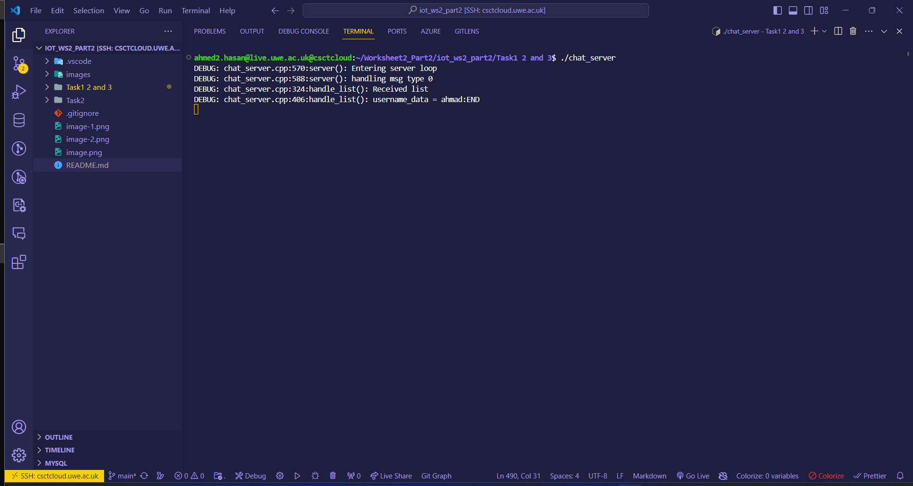

Joining Clients (Client Side):
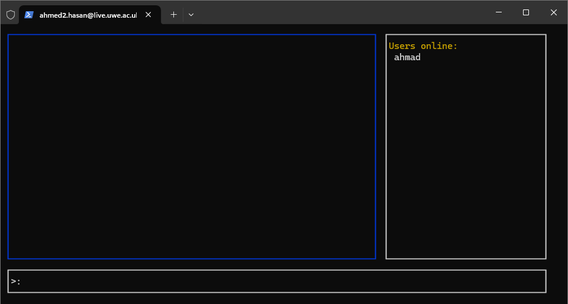

Sending a Message (Server Side):
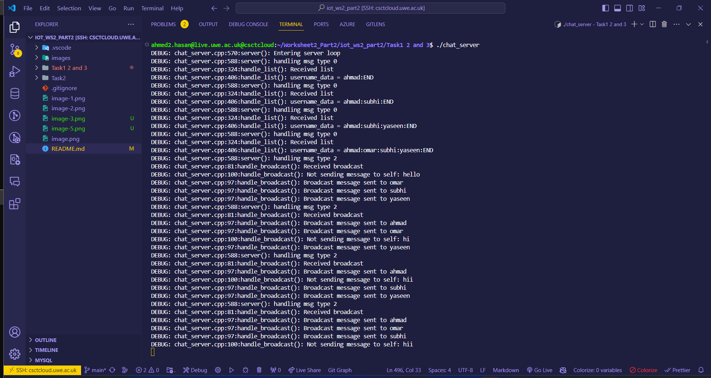

Sending a Message (Client Side):
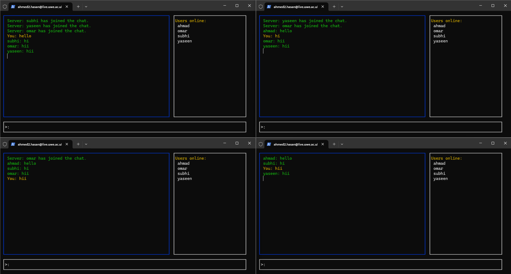

Direct Message (Server Side):
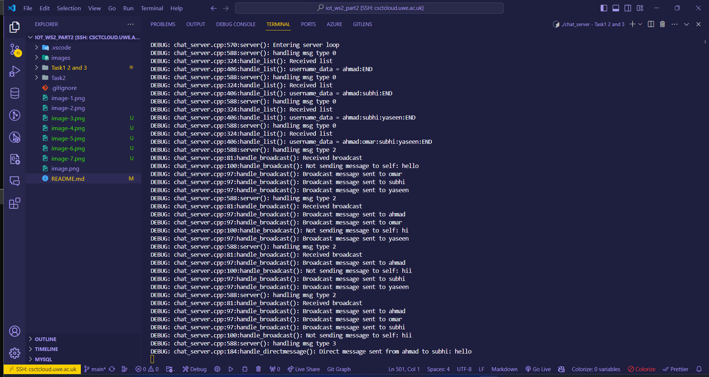

Direct Message (Client Side):
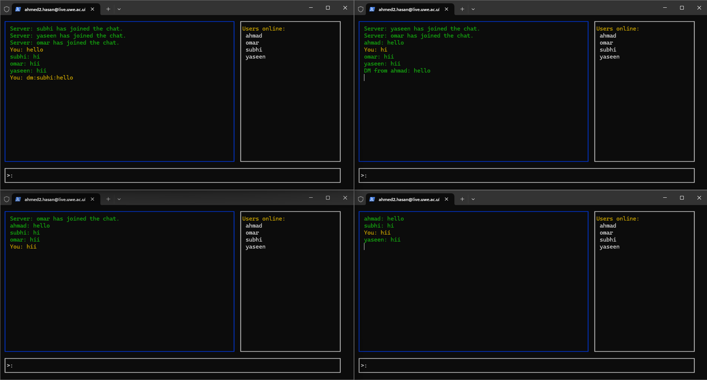

Leaving user (Server Side):
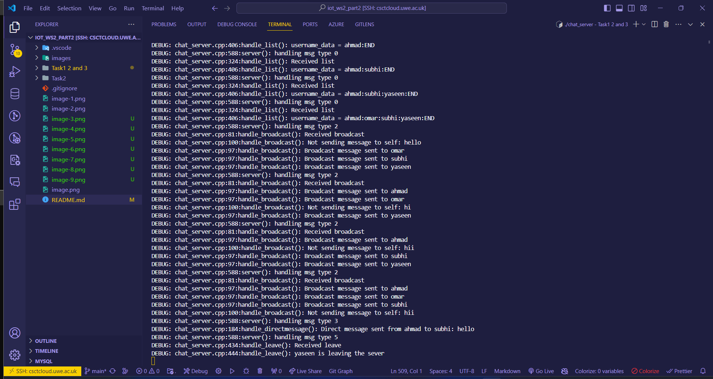

Leaving User (Client Side):
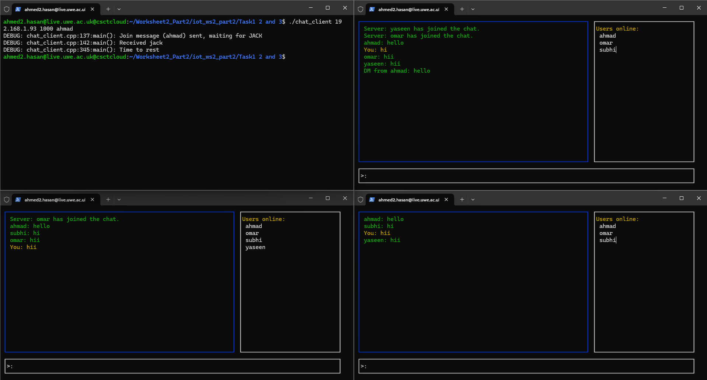

Exit (Server Side):
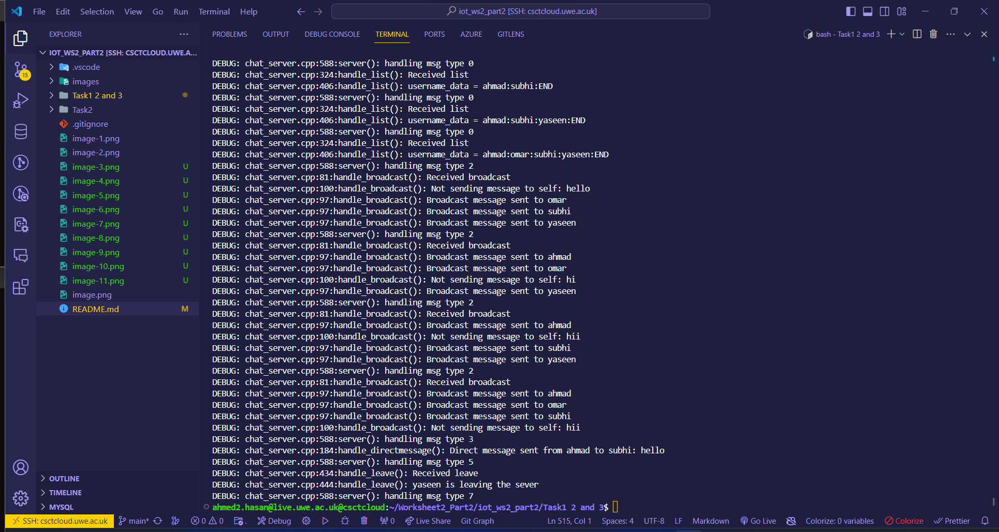

Exit (Client Side):
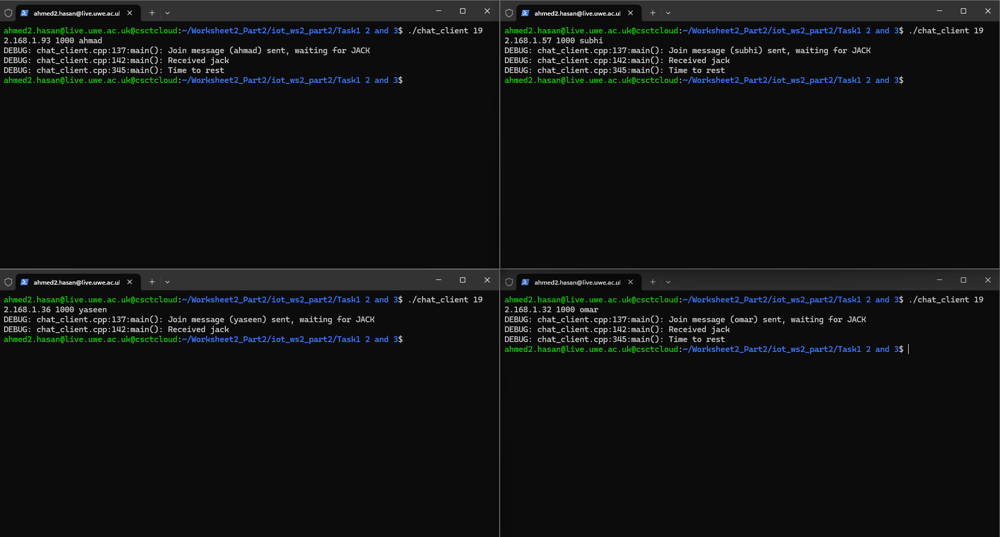

## Task 3: Groups and Group Messaging

### Task Overview
This extension introduces group messaging to the existing chat protocol, facilitating communication among subsets of users, regardless of their online status. Key features include the ability to create groups, add users to these groups, and send messages within them. To implement this, we've introduced modifications to the chat.hpp header file, now referred to as chat_ex.hpp, to support new message types and group management commands. The primary commands introduced include creategroup(...), for initializing new groups, and additional commands for adding members and messaging within groups. Detailed instructions on using these new features, alongside updates made to client and server source files to accommodate the extended protocol, are provided to ensure ease of use and integration into existing IoT frameworks. This part of the README aims to guide users through the new group messaging functionality, ensuring a seamless experience in enhancing communication capabilities within their IoT applications.

### Files
- <code style="color : lightGreen">chat_ex.hpp</code>
- <code style="color : lightGreen">chat_server.cpp</code>
- <code style="color : lightGreen">chat_client.cpp</code>

## Group Creation
- Syntax : creategroup::groupName:user1:user2:user3...
- chat_ex.hpp:

    ~~~ c++
    inline chat_message creategroup_msg(std::string groupname, std::vector<std::string> usernames) {
    chat_message msg{CREATEGROUP, {'\0'}, {'\0'}, {'\0'}};
    
    // Set the groupname_ field
    std::string safe_groupname = groupname.substr(0, MAX_USERNAME_LENGTH - 1);
    memcpy(&msg.groupname_[0], safe_groupname.c_str(), safe_groupname.length());
    msg.groupname_[safe_groupname.length()] = '\0';

    // Concatenate usernames for the message_ field
    std::string concatenatedUsernames;
    for (const std::string& username : usernames) {
        if (concatenatedUsernames.length() + username.length() + 1 >= MAX_MESSAGE_LENGTH - 1) {
            break;
        }
        if (!concatenatedUsernames.empty()) concatenatedUsernames += ":";
        concatenatedUsernames += username;
    }

    // Set the message_ field with concatenated usernames
    memcpy(&msg.message_[0], concatenatedUsernames.c_str(), concatenatedUsernames.length());
    msg.message_[concatenatedUsernames.length()] = '\0';

    return msg;
    }
    ~~~
- chat_server.cpp:

    ~~~c++
    std::map<std::string, std::vector<std::string>> groups;

    void handle_creategroup(
        online_users& users, std::string, std::string msg, // Notice the groupname parameter is removed from here
        struct sockaddr_in& client_address, uwe::socket& sock, bool& exit_loop) {
            
        // Split the input message to extract the group name and the member usernames
        std::istringstream iss(msg);
        std::string groupname;
        getline(iss, groupname, ':'); // Extract the first part as the group name

        // Log the extracted group name
        DEBUG("Attempting to create group with name: '%s'\n", groupname.c_str());
        DEBUG("this is msg: '%s'\n", msg.c_str()); 

        // Continue with the check if the group already exists
        if (groups.find(groupname) != groups.end()) {
            DEBUG("Group '%s' already exists\n", groupname.c_str());
            handle_error(ERR_UNEXPECTED_MSG, client_address, sock, exit_loop);
            return;
        }

        // Parse the rest of the user list from the message
        std::vector<std::string> usernames;
        std::string user;
        while (getline(iss, user, ':')) {
            if (users.find(user) != users.end()) { // Ensure user is online
                usernames.push_back(user);
            }
        }

        // The rest of the function remains unchanged
        // Add the creator to the group if not already in the list
        std::string creatorUsername;
        for (const auto& user_pair : users) {
            if (client_address.sin_addr.s_addr == user_pair.second->sin_addr.s_addr &&
                client_address.sin_port == user_pair.second->sin_port) {
                creatorUsername = user_pair.first; // Save creator's username
                if (std::find(usernames.begin(), usernames.end(), creatorUsername) == usernames.end()) {
                    usernames.push_back(creatorUsername);
                }
                break;
            }
        }

        // Check if we have at least two members (including the creator)
        if (usernames.size() < 2) {
            DEBUG("Not enough members to create group '%s'\n", groupname.c_str());
            handle_error(ERR_UNEXPECTED_MSG, client_address, sock, exit_loop);
            return;
        }

        // Create the group in the map
        groups[groupname] = usernames;

        // Send a confirmation message back to the creator
        auto confirm_msg = chat::broadcast_msg("Server", "Group '" + groupname + "' created successfully.");
        DEBUG("Group '%s' created successfully with members:\n", groupname.c_str());
        for (const auto& user : usernames) {
            DEBUG(" - %s\n", user.c_str());
        }
        sock.sendto(reinterpret_cast<const char*>(&confirm_msg), sizeof(confirm_msg), 0,
                    (sockaddr*)&client_address, sizeof(struct sockaddr_in));
    }

    ~~~

- chat_client.cpp:

    ~~~c++
    case chat::CREATEGROUP: {
                            if (cmds.size() >= 2) {
                                std::string groupname = cmds[1];
                                std::vector<std::string> usernames;
                                for (size_t i = 2; i < cmds.size(); ++i) {
                                    usernames.push_back(cmds[i]);
                                }
                                chat::chat_message group_msg = chat::creategroup_msg(groupname, usernames);
                                sock.sendto(reinterpret_cast<const char*>(&group_msg), sizeof(group_msg), 0,
                                            (sockaddr*)&server_address, sizeof(server_address));
                            }
                            break;
                        }
    ~~~

In the extended chat protocol, group creation is facilitated through modifications across chat_ex.hpp, chat_server.cpp, and chat_client.cpp. The process begins with chat_ex.hpp, where a new message type, CREATEGROUP, is introduced alongside a function, creategroup_msg, which crafts a chat message encapsulating a group name and a concatenated list of member usernames, adhering to predefined length constraints. Within chat_server.cpp, a global map tracks group names against member lists, with the handle_creategroup function extracting the group name and members from the received message, ensuring uniqueness of the group name, validating member existence and count, and automatically adding the creator to the group if not included. Upon successful validation, the group is registered in the server's group map, and a confirmation message is dispatched back to the creator. On the client side, chat_client.cpp processes user commands to create groups, constructing and sending a creategroup_msg to the server. This implementation showcases a seamless extension of the chat protocol to support dynamic group management, leveraging server-client communication to validate and execute group creation requests, thereby enhancing the protocol's functionality to include group-based messaging capabilities.

### Group Messaging
- NOTE: The messaging function is not working but the base is there.

- Syntax: msggroup:groupName:Message

- chat_ex.hpp:
    ~~~c++
    inline chat_message messagegroup_msg(std::string groupname, std::string message) {
    chat_message msg{MESSAGEGROUP, '\0', '\0'};
    memcpy(&msg.groupname_[0], groupname.c_str(), groupname.length());
    msg.groupname_[groupname.length()] = '\0';
    memcpy(&msg.message_[0], message.c_str(), message.length());
    msg.message_[message.length()] = '\0';
    return msg;
    }
    ~~~
    
- chat_server.cpp:
    ~~~c++
    void handle_messagegroup(
    online_users& users, std::string username, std::string message,
    struct sockaddr_in& client_address, uwe::socket& sock, bool& exit_loop) {
    DEBUG("Received messagegroup\n");
    //find group and send a debug message of the group name
    for (const auto& group : groups) {
        if (group.first.compare(username) == 0) {
            DEBUG("Group name: %s\n", group.first.c_str());
        }
    }
    // Extract the groupname from the username field of the chat_message
    // Assuming the groupname is correctly placed in the username field for the group message scenario
    std::string groupname = username; 

    // Check if the group exists
    auto it = groups.find(groupname);
    if (it == groups.end()) {
        // Group does not exist, send an error message
        handle_error(ERR_UNKNOWN_USERNAME, client_address, sock, exit_loop);
        return;
    }

    // Log for debugging
    DEBUG("Group message to '%s': %s\n", groupname.c_str(), message.c_str());

    // Construct the group message
    auto gm_msg = chat::messagegroup_msg(groupname, message);

    // Send the message to all group members
    for (const std::string& username : it->second) {
        auto user_it = users.find(username);
        if (user_it != users.end()) { // Ensure member is online
            sock.sendto(reinterpret_cast<const char*>(&gm_msg), sizeof(gm_msg), 0,
                        (sockaddr*)user_it->second, sizeof(sockaddr_in));
            DEBUG("Sent to %s\n", username.c_str());
        }
    }
    }
    ~~~
- chat_client.cpp:
    ~~~c++
    case chat::MESSAGEGROUP: {
                            // Inside the main loop where commands from the GUI are processed
                            if (cmds.size() >= 3 && cmds[0] == "msggroup") {
                                std::string groupname = cmds[1];
                                std::string message = cmds[2];
                                for (size_t i = 3; i < cmds.size(); ++i) {
                                    message += ":" + cmds[i]; // Assuming ':' is not used in group names
                                }
                                
                                chat::chat_message msg = chat::messagegroup_msg(groupname, message);
                                sock.sendto(reinterpret_cast<const char*>(&msg), sizeof(msg), 0,
                                            (sockaddr*)&server_address, sizeof(server_address));
                            }
                        break;
                    }
    ~~~

In the enhancement to the chat protocol that introduces the capability to send messages within groups, chat_ex.hpp is updated to include a new function messagegroup_msg for crafting a group message. This function initializes a chat_message struct with a specified MESSAGEGROUP type, setting the groupname_ and message_ fields based on the provided group name and message content, respectively. The server's handling of this message type, as outlined in chat_server.cpp, involves parsing the received message to identify the target group and then iterating over the group members to send the message to each online user. This is achieved by extracting the group name from the username field of the message (a creative reuse of this field for group messaging purposes) and leveraging a global map that tracks group memberships. Upon locating the group, the server reconstructs the group message using messagegroup_msg and dispatches it to all online members of the group. On the client side, as detailed in chat_client.cpp, users can initiate a group message by constructing a command with the msggroup keyword, followed by the group name and the message itself. The client then concatenates any additional message components separated by colons (assuming colons are not used in group names) and sends the formatted message to the server using the messagegroup_msg function. This implementation demonstrates the protocol's flexibility in supporting direct group communication, leveraging existing infrastructure with minimal modifications to enable a rich messaging experience.

### Expected Output:
- Create Group (Server Side):
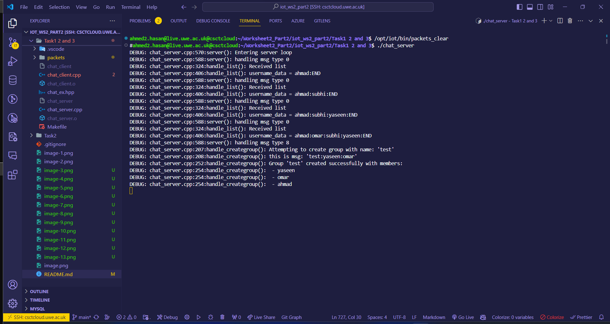

- Create Group (Client Side):
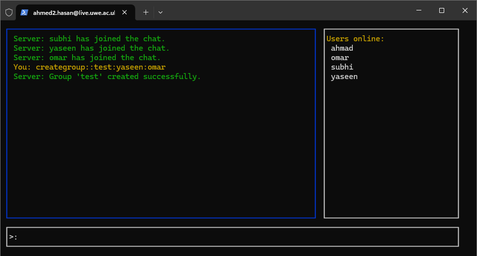
- Message group: Not working but the handle is activated in the terminal
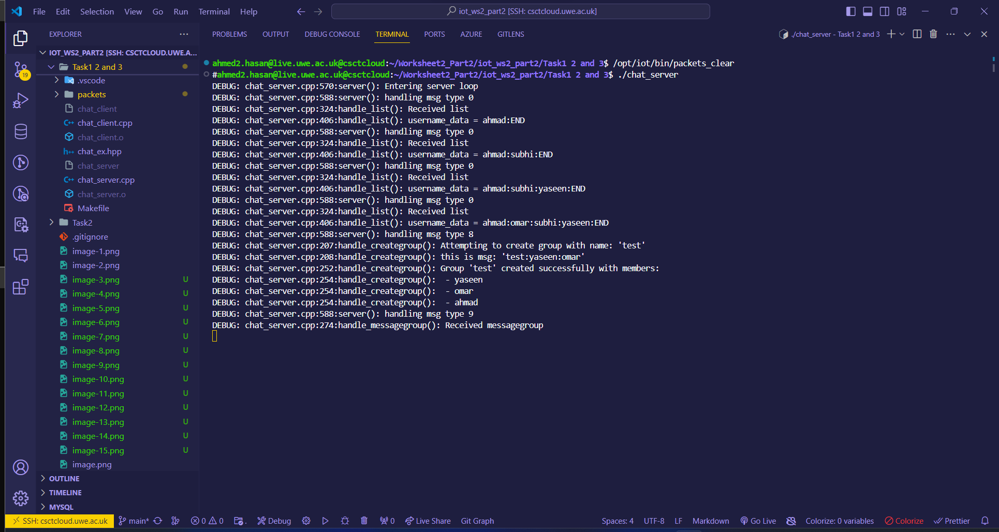
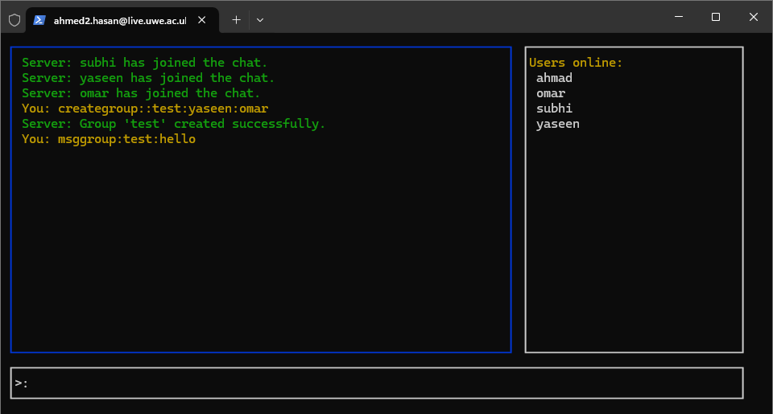

## Conclusion
The IoT Chat Application project offers a comprehensive platform for real-time communication between clients through a server, showcasing the intricacies of network programming, message handling, and protocol design within the realm of Internet of Things (IoT). By successfully implementing the server and client sides of the application, students gain practical experience in developing a multi-threaded chat application that supports both direct and broadcast messaging, along with advanced features like group messaging.

This project emphasizes the importance of understanding communication protocols, thread management, and the effective use of data structures for managing user states and messages. The development process highlighted the challenges of ensuring non-blocking communication and the necessity of debugging tools and practices for monitoring and correcting application behavior in real-time.

## Additional Information

* **Debugging and Monitoring:** The project leverages the **"DEBUG()"** macro and stderr redirection to facilitate real-time debugging and monitoring without disrupting the user interface. This approach is crucial for identifying and resolving issues in a multi-threaded environment where the application's state changes rapidly.

* **Group Messaging:** The introduction of group messaging functionality extends the application's use case, allowing for more dynamic interactions among users. Implementing this feature required careful consideration of the chat protocol's design to support new message types and group management commands.

* **Scalability and Performance:** While the project successfully demonstrates the core functionalities of a chat application, future enhancements could focus on scalability and performance optimizations, especially as the number of concurrent users grows. Techniques such as asynchronous I/O operations, efficient message broadcasting, and dynamic thread pool management could be explored.

* **Security Considerations:** Although not the primary focus of this project, security is a critical aspect of chat applications. Future iterations could implement features like message encryption, authentication mechanisms, and protection against common vulnerabilities to ensure secure communication.

* **User Experience:** The current implementation provides a basic user interface for interaction. Enhancing the UI/UX with features such as user-friendly command parsing, message formatting, and notification mechanisms would significantly improve the overall user experience.

* **Community and Contribution:** The project encourages contributions from the community. Developers interested in contributing can fork the repository, implement new features or improvements, and submit pull requests. This collaborative approach will help in refining the application and adding new functionalities.